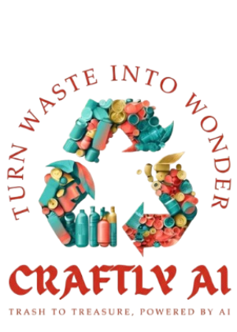

# 🎨 Craftly AI - Turn Waste into Wonder

[](https://craftly-ai-swqv-nrgqskao-chander-parkash007s-projects.vercel.app)
[](https://github.com/Chander-parkash007/Craftly-Ai)
[](LICENSE)

An AI-powered web application that transforms household waste into creative DIY craft projects. Simply upload photos of recyclable materials, and our AI generates personalized, step-by-step craft ideas in seconds!



## ✨ Features

- 📸 **Image Recognition**: Upload photos of household items (bottles, cardboard, paper, fabric, etc.)
- 🤖 **AI Detection**: Computer vision identifies recyclable materials and their craft potential
- 🎨 **Smart Generation**: AI generates 4 unique, personalized DIY craft ideas based on:
  - Available materials
  - User's skill level (beginner/intermediate)
  - Time available (5-30 minutes)
  - Purpose (home decor, gifts, school projects, kids crafts)
  - Available tools (scissors, glue, paint, tape)
- 📝 **Step-by-Step Guides**: Each craft comes with detailed instructions, material lists, and pro tips
- ❤️ **Save & Organize**: Users can save favorite projects and access them anytime
- 👤 **User Accounts**: Secure authentication with persistent sessions
- 📱 **Mobile-First**: Fully responsive design that works on all devices

## 🚀 Live Demo

Try it out: [Craftly AI on Vercel](https://craftly-ai-swqv-nrgqskao-chander-parkash007s-projects.vercel.app)

## 🛠️ Tech Stack

### Frontend
- **React 18** - Modern UI with hooks and functional components
- **Lucide React** - Beautiful, consistent iconography
- **CSS-in-JS** - Responsive design with gradient aesthetics
- **LocalStorage API** - Client-side data persistence

### AI/ML
- **Groq API** - Ultra-fast AI inference (< 1 second responses)
- **Llama 3.2 90B Vision** - Image analysis and material detection
- **Llama 3.3 70B Versatile** - Creative craft idea generation
- **Custom Prompts** - Engineered for diverse, practical suggestions

### Deployment
- **Vercel** - Serverless deployment with automatic CI/CD
- **Git** - Version control and collaboration

## 📦 Installation

### Prerequisites
- Node.js 16+ and npm
- Groq API key (get free at [console.groq.com](https://console.groq.com))

### Setup

1. **Clone the repository**
```bash
git clone https://github.com/Chander-parkash007/Craftly-Ai.git
cd Craftly-Ai
```

2. **Install dependencies**
```bash
npm install
```

3. **Configure environment variables**

Create a `.env` file in the root directory:
```env
REACT_APP_GROQ_API_KEY=your_groq_api_key_here
```

Get your free Groq API key:
- Visit https://console.groq.com
- Sign up (no credit card required)
- Create an API key
- Copy and paste it in the `.env` file

4. **Start the development server**
```bash
npm start
```

5. **Open your browser**
```
http://localhost:3000
```

## 🎯 How to Use

1. **Sign Up / Login**: Create an account or login to save your crafts
2. **Upload Images**: Take photos or upload images of household items (max 5)
3. **Detect Materials**: AI identifies recyclable materials in your images
4. **Review & Edit**: Confirm or modify detected materials, add more if needed
5. **Set Preferences**: Choose skill level, time available, purpose, and tools
6. **Generate Ideas**: Get 4 unique, personalized craft suggestions
7. **View Details**: See step-by-step instructions for each craft
8. **Save Favorites**: Bookmark crafts you want to try later

## 🏗️ Project Structure

```
craftly-ai/
├── public/
│   ├── index.html
│   └── logo.png
├── src/
│   ├── App.jsx           # Main application component
│   ├── api.js            # Groq API integration
│   ├── DiagnosticPage.jsx # Debug tool
│   ├── index.js          # Entry point
│   └── index.css         # Global styles
├── .env                  # Environment variables (not in repo)
├── .gitignore
├── package.json
├── vercel.json           # Vercel configuration
└── README.md
```

## 🌟 Key Features Explained

### AI-Powered Material Detection
- Uses Llama 3.2 90B Vision model
- Analyzes images to identify recyclable materials
- Provides emoji icons for visual recognition
- Fallback detection for common materials

### Creative Craft Generation
- Uses Llama 3.3 70B Versatile model
- Generates unique ideas based on user preferences
- Randomization ensures variety
- Detailed step-by-step instructions
- Pro tips for better results

### User Authentication
- Secure signup and login
- Session persistence across page refreshes
- Per-user saved crafts
- Logout functionality

### Save & Organize
- Save favorite crafts with one click
- View all saved crafts in dedicated tab
- Persistent storage using localStorage
- Timestamp tracking

## 🚀 Deployment

### Deploy to Vercel

1. **Install Vercel CLI**
```bash
npm i -g vercel
```

2. **Login to Vercel**
```bash
vercel login
```

3. **Deploy**
```bash
vercel --prod
```

4. **Set Environment Variables**
- Go to Vercel Dashboard → Your Project → Settings
- Add `REACT_APP_GROQ_API_KEY` with your API key
- Check all environments (Production, Preview, Development)
- Redeploy

### Environment Variables on Vercel

Make sure to set:
- **Key**: `REACT_APP_GROQ_API_KEY`
- **Value**: Your Groq API key (starts with `gsk_`)
- **Environments**: Production ✅ Preview ✅ Development ✅

## 🧪 Testing

Visit `/test-features.html` for an interactive test suite that checks:
- localStorage functionality
- User authentication
- Save/unsave features
- API integration
- Logo loading

## 🤝 Contributing

Contributions are welcome! Please feel free to submit a Pull Request.

1. Fork the repository
2. Create your feature branch (`git checkout -b feature/AmazingFeature`)
3. Commit your changes (`git commit -m 'Add some AmazingFeature'`)
4. Push to the branch (`git push origin feature/AmazingFeature`)
5. Open a Pull Request

## 📝 License

This project is licensed under the MIT License - see the [LICENSE](LICENSE) file for details.

## 👥 Team

- **Backend & AI Integration** - API integration, AI models, data management
- **Frontend Development** - React architecture, state management, components
- **UI/UX Design** - Design system, styling, animations, testing
- **Documentation** - README, guides, testing, Devpost submission

## 🙏 Acknowledgments

- [Groq](https://groq.com) for fast AI inference
- [Meta](https://ai.meta.com) for Llama models
- [Lucide](https://lucide.dev) for beautiful icons
- [Vercel](https://vercel.com) for seamless deployment

## 📧 Contact

For questions or feedback, please open an issue on GitHub.

---

**Built with ❤️ for a sustainable future** 🌱

*Making upcycling accessible and fun, one craft at a time!*
